# bolao

Projeto de plataforma online para o "bolão da copa".

## Ideia

Este projeto foi criado com o intuito de aprendizado de desenvolvimento e de novas tecnologias.

Além disso, o foco era facilitar e melhorar a forma como era feito os bolões no meu grupo de amigos e familiares, sem precisar fazer as apostas no papel ou em planilhas no Excel e com visualização em tempo real.

## O Projeto

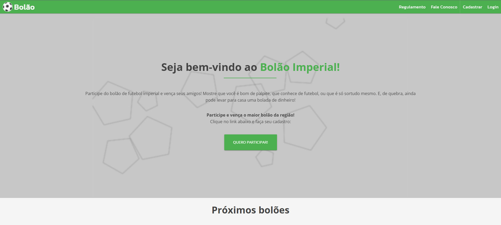

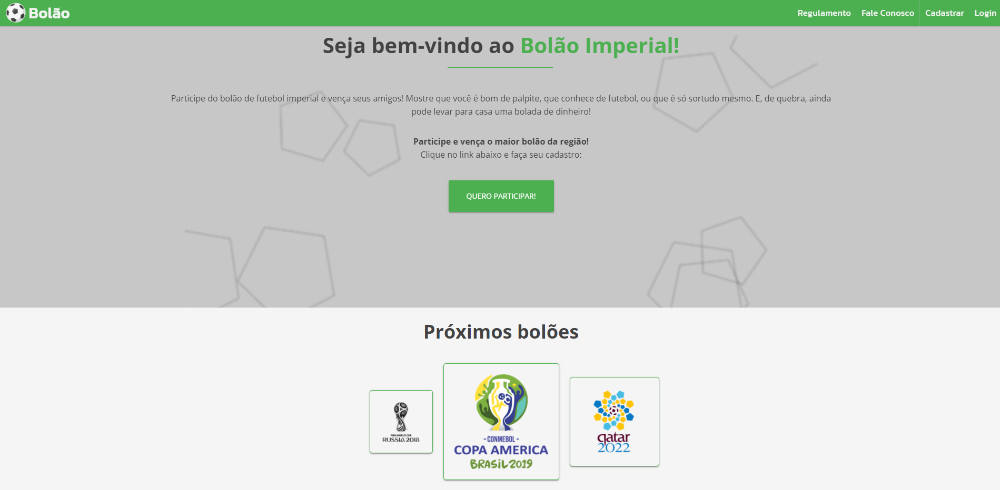

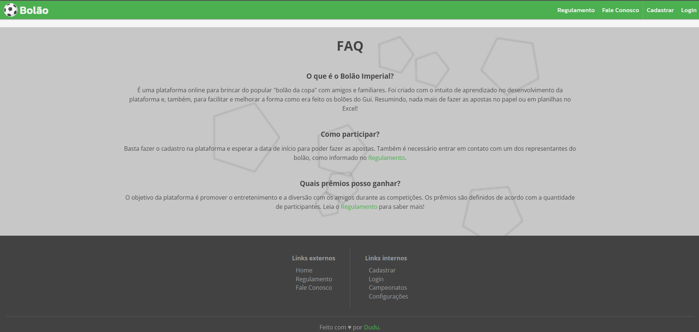

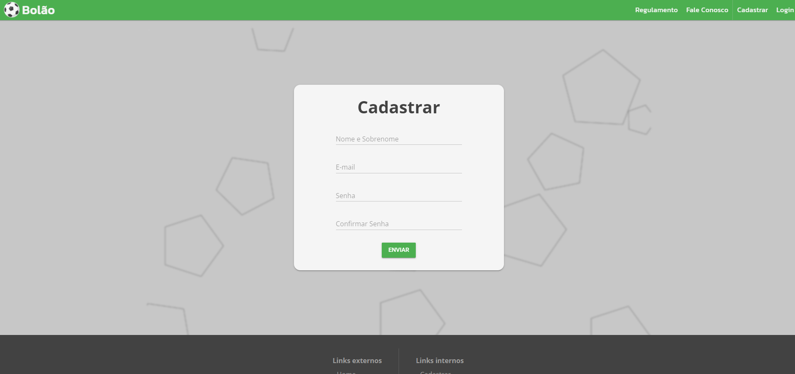

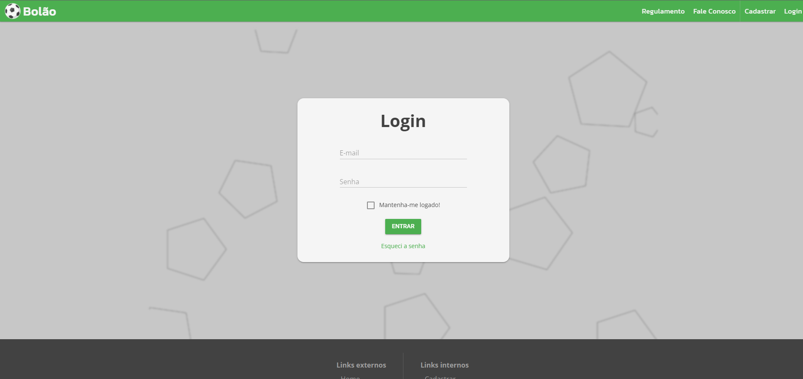

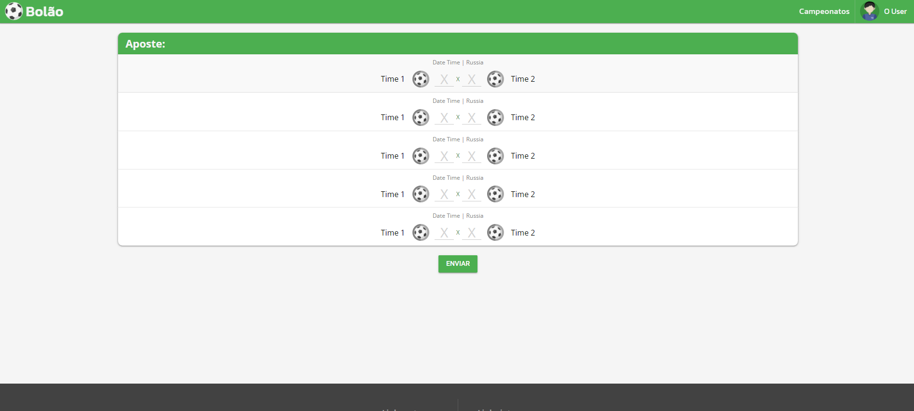

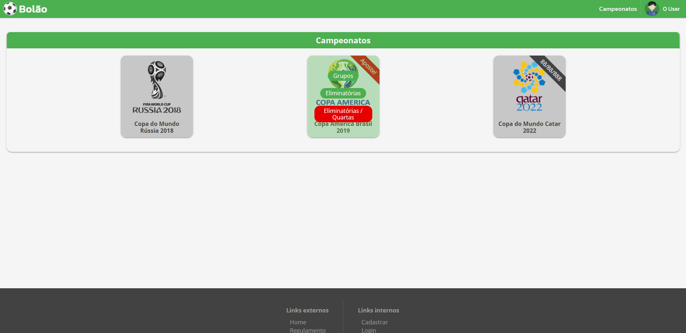

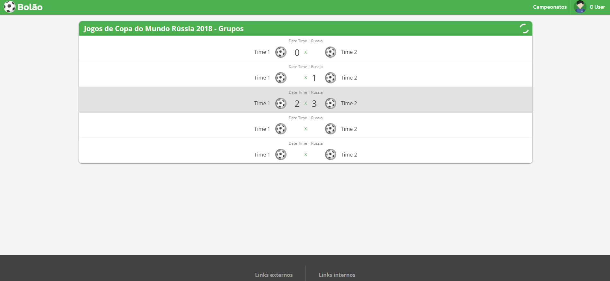

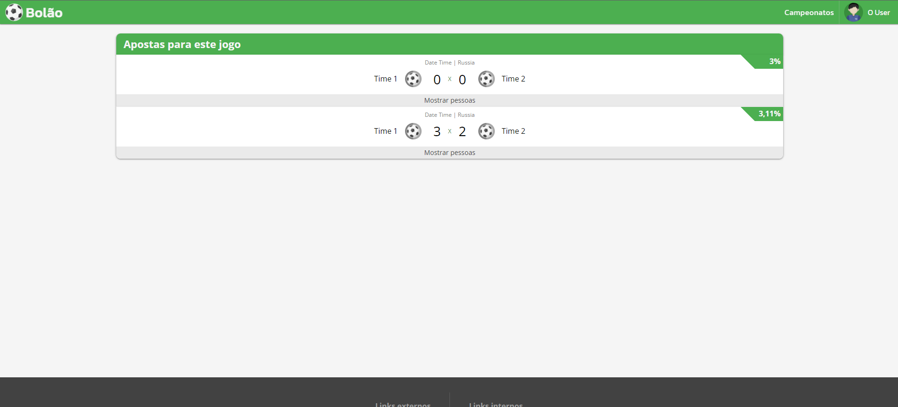

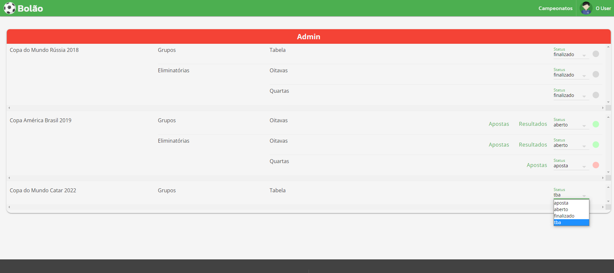

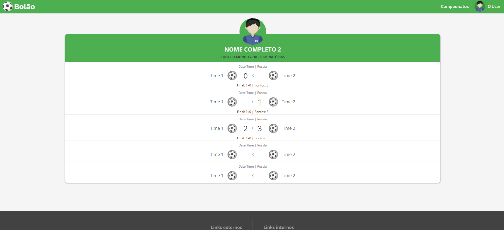

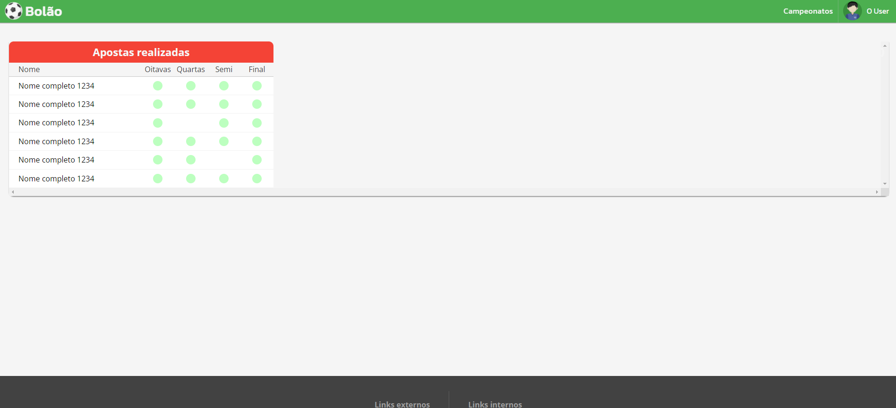

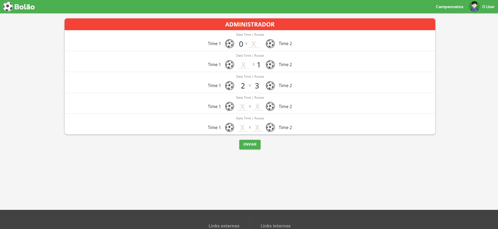

