# bolao

Projeto de plataforma online para o "bolão da copa".

## Ideia

Este projeto foi criado com o intuito de aprendizado de desenvolvimento e de novas tecnologias.

Além disso, o foco era facilitar e melhorar a forma como era feito os bolões no meu grupo de amigos e familiares, sem precisar fazer as apostas no papel ou em planilhas no Excel e com visualização em tempo real.


## O Projeto

### Tela inicial

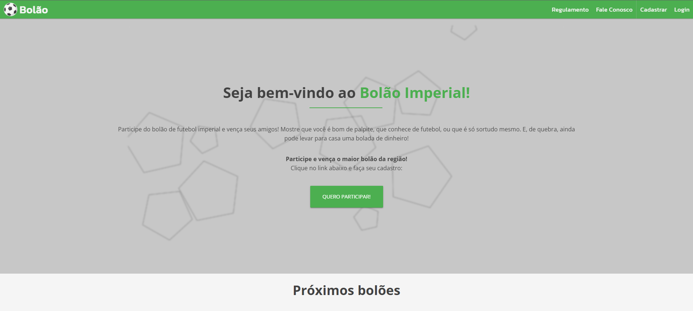

### Tela Cadastro e Login

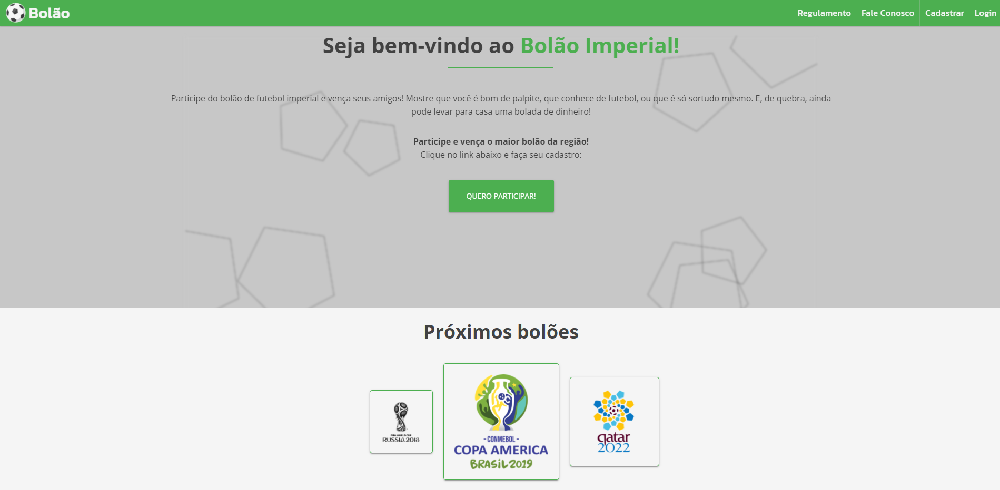

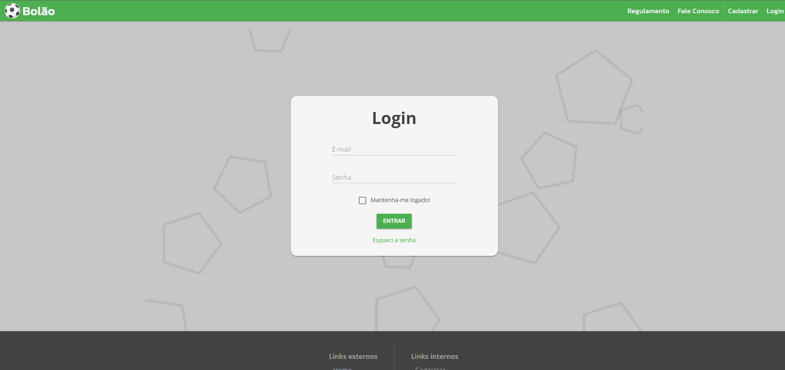

### Tela de loading

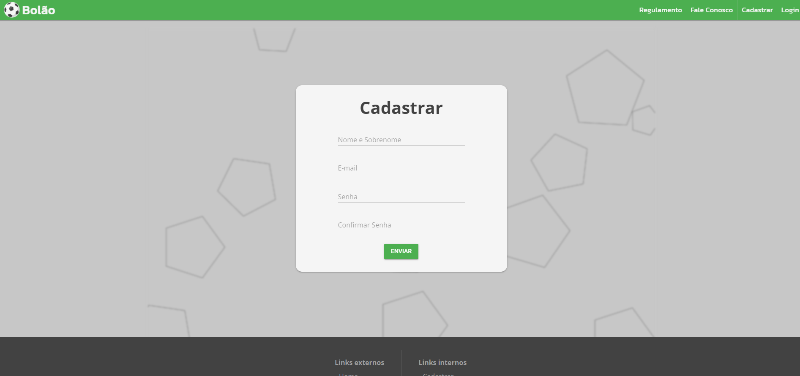

### Tela de campeonatos

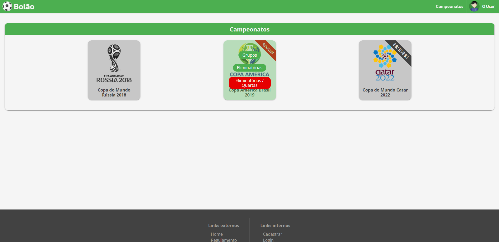

### Tela de aposta


### Tela de dashboard do campeonato


### Tela de jogos do campeonato

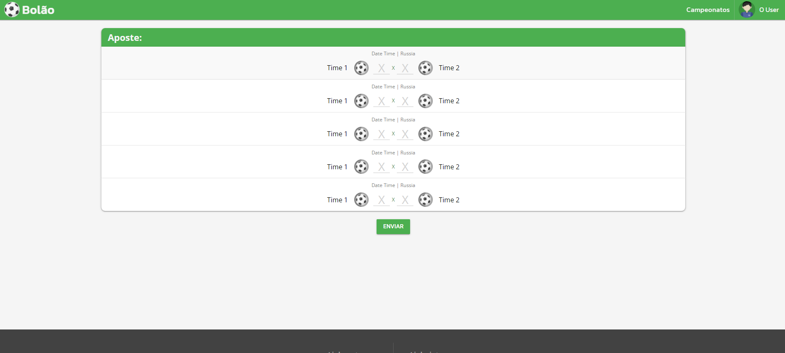

### Tela de apostas para um jogo

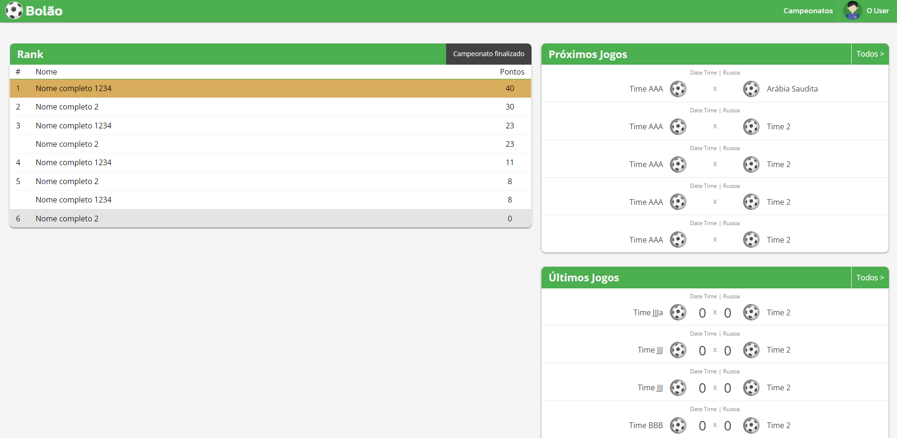

### Tela de apostas de um usuário

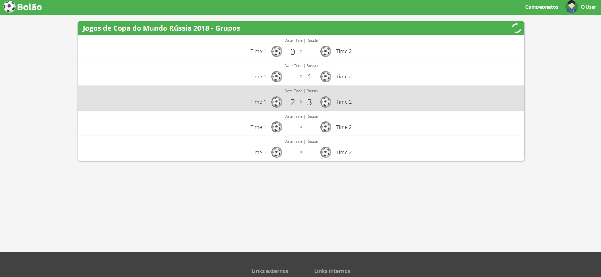

### Tela de configurações

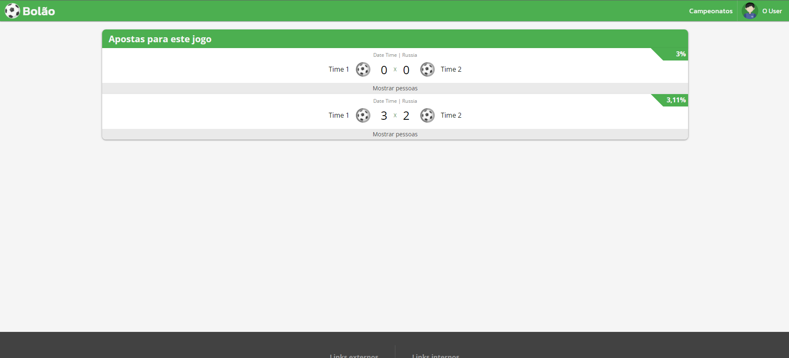

### Tela de administrador

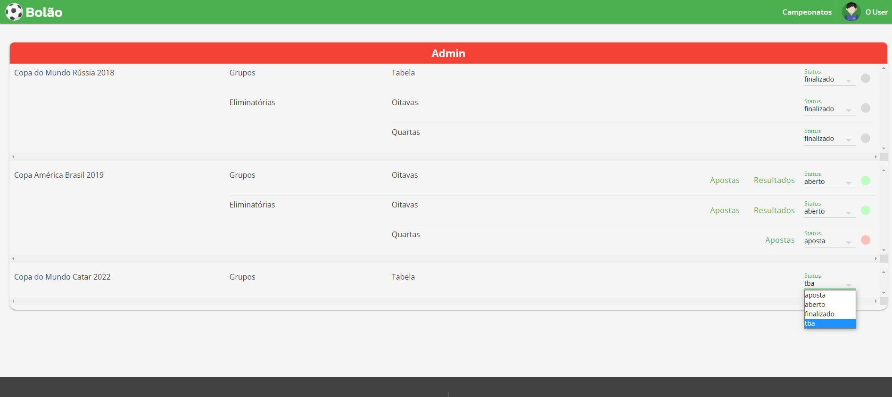

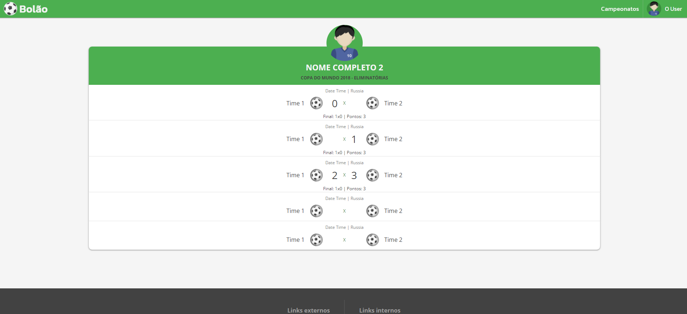

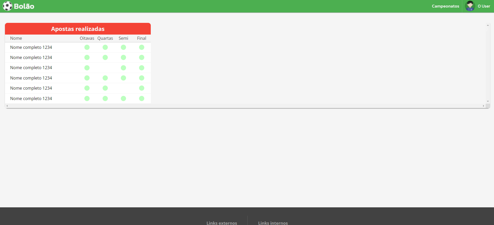

## Pré-requisitos

Instalar os componentes:

- `Node 24.14.x` ~ Front-End;
- `PHP 8.5` ~ Back-End;
    - `Composer 2.9.5` ~ PHP Dependency Manager;
- `MariaDB 11.4.10` ~ Database;
    - Ou no `Docker Desktop 4.67` ~ Container platform;

### Instalar dependências

Instale as dependências da `api`, do `app` e do `banco` com o comando:

```bash
npm run install-all
```

Se for utilizar o docker, rode o comando:

```bash
npm run install-mariadb
```

### Configurações necessárias

#### Database

Conecte no banco utilizando as credenciais abaixo e crie o banco `bolao`:
- Username: `root`;
- Password: `123456`;

Crie e configure o arquivo `knexfile.js` baseado no arquivo `knexfile.sample.js`.

Crie toda a estrutura do banco rodando o comando:

```bash
npm run knex migrate:latest
```

Se quiser, rode o comando abaixo para preencher o banco com alguns dados padrões:

```bash
npm run knex seed:run
```

#### API

1. Pode ser necessário configurar o php para acessar o banco mariadb/mysql, para isso:
    - Copie o arquivo o `php.ini-development` e cole como `php.ini`.
    - Abra o arquivo e ajuste as seguintes informações:
        - Remova o símbolo `;` da linha `;extension_dir = "ext"`.
        - Remova o símbolo `;` da linha `;extension=pdo_mysql`.

2. Crie e configure o arquivo `.env` baseado no arquivo `.env.development`.

3. Crie um par de chaves `RSA` para os tokens JWT:
    - Execute no `Git Bash` os comandos:
        - Criar chave privada: `openssl genrsa -out private.key 2048`.
        - Extrair chave pública: `openssl rsa -in private.key -pubout -out public.pem`.
    - Configure corretamente no arquivo `.env`.

### Executar

Para executar tudo será necessário rodar os comandos abaixo em terminais diferentes e deixá-los abertos executando.

Iniciar API:

```bash
npm run server
```

Iniciar APP:

```bash
npm run start
```

Se estiver utilizando o banco no docker:

```bash
npm run mariadb
```

## Deploy

### Configurações necessárias

#### API

Crie e configure o arquivo `.env.production` baseado no arquivo `.env.development`.

Este arquivo será consumido pelo processo de deploy explicado abaixo.

#### APP

Crie e configure o arquivo `.env.production` baseado no arquivo `.env.development`.

Este arquivo será consumido pelo processo de deploy explicado abaixo.

### Front & Back-End

Para gerar o diretório `deploy` com tudo que é necessário para o ambiente produtivo:

```bash
npm run deploy
```

Será gerado um diretório com o seguinte formato:

```
📦deploy
 ┣ 📂api
 ┃ ┗ 📜.env
 ┣ 📂imagens
 ┣ 📂imgs
 ┣ 📂static
 ┣ 📜 ...
 ┗ 📜index.html
```

O conteúdo deste diretório pode ser copiado diretamente para o servidor, não há necessidade de modificá-lo.

Dependendo do servidor pode ser necessário criar o arquivo `.htaccess` com a seguinte configuração:

```
Options -MultiViews
RewriteEngine On
RewriteCond %{REQUEST_FILENAME} !-f
RewriteRule ^ index.html [QSA,L]
```

### Database

Para somente gerar os SQLs para executar no banco de dados:
1. Crie um schema "vazio" ou rode um rollback.
2. Modifique o parâmetro `logQuery` para `true`, no arquivo `database/knexfile.js`.
3. Rode o comando de migration: `npm run knex migrate:latest`.
4. Rode o comando de seed: `npm run knex seed:run`.
