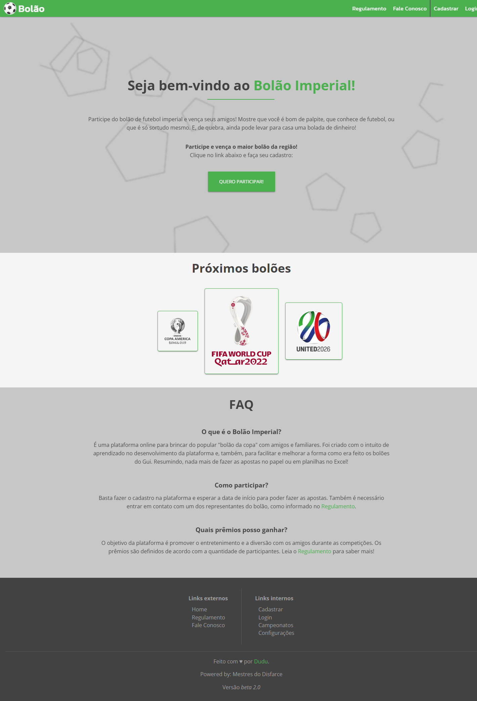
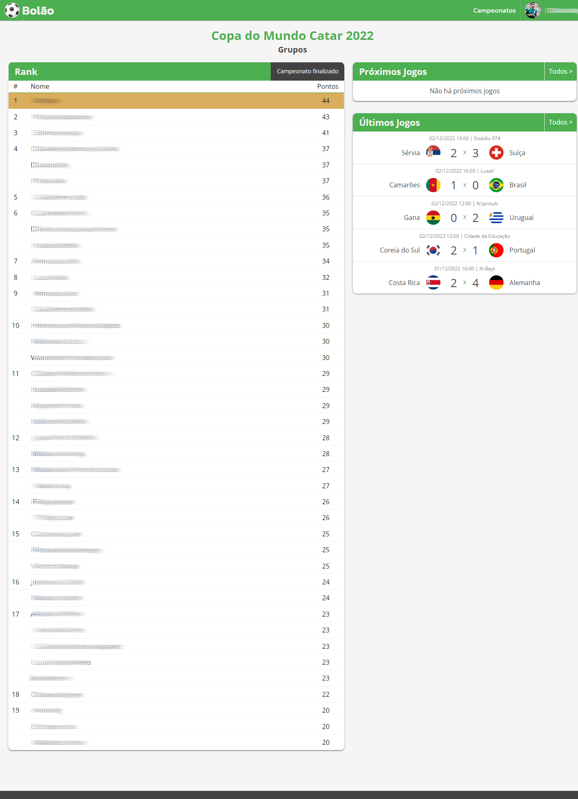
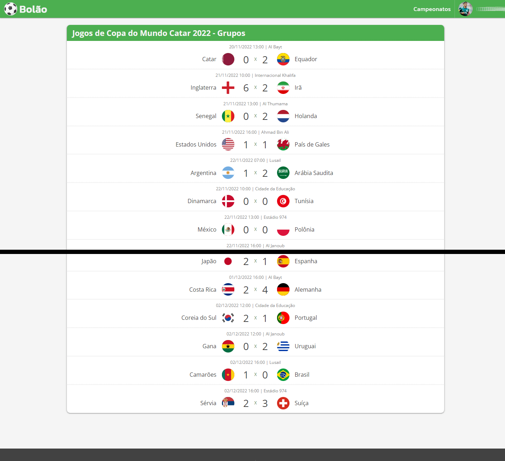
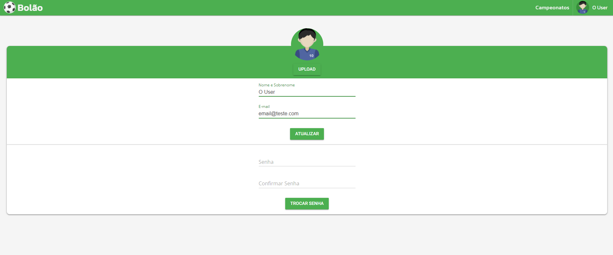

# bolao

Projeto de plataforma online para o "bolão da copa".

## Ideia

Este projeto foi criado com o intuito de aprendizado de desenvolvimento e de novas tecnologias.

Além disso, o foco era facilitar e melhorar a forma como era feito os bolões no meu grupo de amigos e familiares, sem precisar fazer as apostas no papel ou em planilhas no Excel e com visualização em tempo real.


## O Projeto












## Pré-requisitos

Instalar os componentes:

- `Node 14` ~ Front-End;
- `PHP 8.0` ~ Back-End;
    - `Composer 2.4` ~ PHP Dependency Manager;
- `MariaDB 10.5` ~ Database;
    - `Docker Desktop 4.12` ~ Container platform;

### Instalar dependências

Instale as dependências da `api`, do `app` e do `banco` com o comando:

```bash
npm run install-all
```

## Desenvolvimento

Instale o banco no docker com o comando:

```bash
docker run --detach --name bolao-mariadb -p 3306:3306 --env MARIADB_ROOT_PASSWORD=123456  mariadb:10.5
```

### Configurações necessárias

#### Database

Conecte no banco utilizando as credenciais abaixo e crie o banco `bolao`:
- Username: `root`;
- Password: `123456`;

Crie e configure o arquivo `knexfile.js` baseado no arquivo `knexfile.sample.js`.

Crie toda a estrutura do banco rodando o comando:

```
npm run knex migrate:latest
```

Se quiser, rode o comando abaixo para preencher o banco com alguns dados padrões:

```bash
npm run knex seed:run
```

#### API

Pode ser necessário configurar o php para acessar o banco mariadb/mysql, para isso:
- Copie o arquivo o `php.ini-development` e cole como `php.ini`.
- Abra o arquivo e ajuste as seguintes informações:
    - Remova o símbolo `;` da linha `;extension_dir = "ext"`.
    - Remova o símbolo `;` da linha `;extension=pdo_mysql`.

Crie e configure o arquivo `.env` baseado no arquivo `.env.development`.

### Executar

Para executar tudo será necessário rodar os comandos abaixo em terminais diferentes e deixá-los abertos executando.

Iniciar API:

```bash
npm run server
```

Iniciar APP:

```bash
npm run start
```

Não esqueça de iniciar o container do banco no docker.


## Deploy

### Configurações necessárias

#### API

Crie e configure o arquivo `.env.production` baseado no arquivo `.env.development`.

#### APP

Crie e configure o arquivo `.env.production` baseado no arquivo `.env.development`.

### Executar

Para gerar o diretório `deploy` com tudo que é necessário para o ambiente produtivo.

```bash
npm run deploy
```
